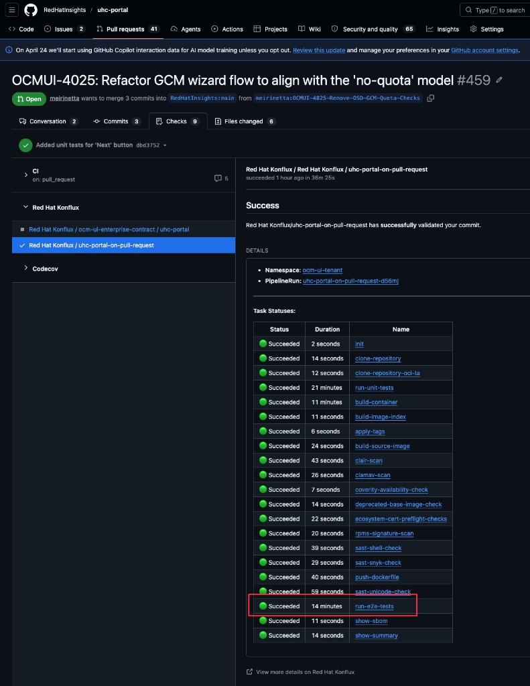
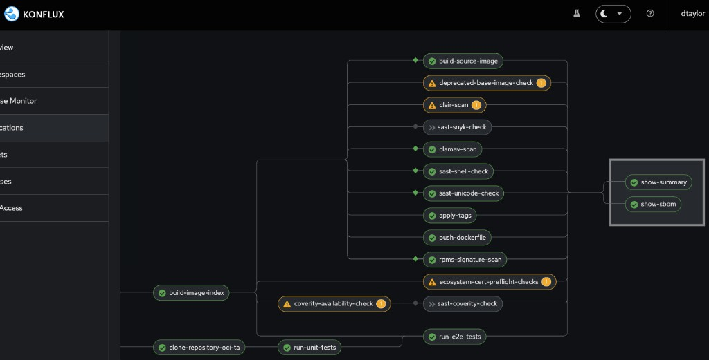

# Konflux PR E2E

## Big picture

Konflux PR e2e testing is assembled from pieces that live in **three different places**. No single repo has the whole thing.

| Where | What lives there | Plain-English role |
|---|---|---|
| **GitHub** — `uhc-portal/.tekton/` | `uhc-portal-pull-request.yaml`, `uhc-portal-push.yaml` | The two "entry points" Konflux watches. They say *when* to run (PR vs. merge) and *what* to run. They don't define the actual build/test steps — they just point at the shared pipeline below. |
| **GitHub (upstream)** — `RedHatInsights/konflux-pipelines` | [`pipelines/platform-ui/docker-build-run-all-tests-v2.yaml`](https://github.com/RedHatInsights/konflux-pipelines/blob/main/pipelines/platform-ui/docker-build-run-all-tests-v2.yaml) | The **shared pipeline**, maintained by Platform Experience (Brandon Tweed). Defines the real steps: build image → security scans → unit tests → run app → run Playwright e2e. Every HCC frontend team points at this file. |
| **GitLab** — `konflux-release-data` (internal) | YAML under `tenants-config/.../ocm-ui-tenant/` | Cluster-side config that has to be in place before our pipeline can even start: routing rules for the test environment, tenant admin permissions, Kustomize wiring. |
| **Konflux UI** (one-time, manual) | `ocm-ui-tenant` namespace | The E2E login credentials secret (`ocm-ui-credentials-secret`). Stored in the cluster via the UI, not in git. |

---

## Triggers summary

> **CEL expression** = Common Expression Language — a lightweight `if` statement that Pipelines-as-Code evaluates against the incoming GitHub webhook to decide whether to launch a PipelineRun.

| When | Which `.tekton/` file | CEL expression | Shared pipeline used | What actually runs |
|---|---|---|---|---|
| PR opened, updated, or `/retest` against `main` | `uhc-portal-pull-request.yaml` | `event == "pull_request" && target_branch == "main"` | `docker-build-run-all-tests-v2.yaml` | Build → security scans → unit tests → **Playwright e2e** |
| Commit lands on `main` (merge) | `uhc-portal-push.yaml` | `event == "push" && target_branch == "main"` | `docker-build-run-unit-tests.yaml` | Build → unit tests. Publishes the production `uhc-portal:{sha}` image. |

### How E2E tests run: sidecars and Caddy

Playwright E2E tests need a running application to test against. In Konflux, we achieve this using **sidecars** — additional containers that run alongside the main test container within the same pod.

Our E2E setup uses two sidecars:
1. **App sidecar** — Runs the built uhc-portal UI using [Caddy](https://caddyserver.com/), a lightweight web server. Caddy serves the static assets on port 8000 using a ConfigMap-based Caddyfile (`ocm-ui-app-caddy-config`).
2. **Proxy sidecar** — Routes requests so that `/openshift/*` paths go to the app sidecar (our code), while everything else (APIs, auth) proxies to `console.dev.redhat.com` (the staging backend). This is configured via `ocm-ui-dev-proxy-caddyfile`.

Both ConfigMaps (`ocm-ui-app-caddy-config` and `ocm-ui-dev-proxy-caddyfile`) are defined in **GitLab — `konflux-release-data`** under the `ocm-ui-tenant` configuration. These were merged as cluster-side resources before our pipeline could use them.

The `hostAliases` setting maps `prod.foo.redhat.com` → `127.0.0.1`, so when Playwright navigates to `https://prod.foo.redhat.com:1337/openshift/`, traffic stays local to the pod and hits our proxy sidecar. The `prod.foo` hostname is whitelisted in `sso.redhat.com`, allowing SSO login to work during tests.

### Our `.tekton/*.yaml` vs. the upstream shared pipeline

It's worth being precise about who owns what, because it's the single most common source of confusion:

|  | **Our files** — `pull-request.yaml` (PR) / `push.yaml` (Push) | **Upstream shared pipeline** (`konflux-pipelines/.../platform-ui/*.yaml`) |
|---|---|---|
| **Kind** | `PipelineRun` — a single *invocation* with inputs (in both files) | `Pipeline` — the reusable *definition* of the work |
| **Scope** | uhc-portal only (in both files) | All HCC frontend apps |
| **Decides when to run** | CEL trigger (in both files) — `event == "pull_request"` (PR), `event == "push"` (Push). Both require `target_branch == "main"`. | |
| **Defines the task graph** — the boxes you see in the Konflux UI and the task list under GitHub Checks |  | ✅ The tasks and their order live entirely in the upstream file. We don't add, remove, or reorder them.    |
| **Defines task names like `run-e2e-tests` / `run-unit-tests`** | We only *reference* them (e.g. `pipelineTaskName: run-e2e-tests` in `taskRunSpecs`). A typo here silently does nothing (in both files). | ✅ Declared in the `tasks:` array of the shared pipeline. |
| **Which container images each task uses** | | ✅ (buildah, clamav, sast, node, Playwright base, etc.) |
| **Provides per-project inputs as params** | `git-url`, `revision`, `output-image`, `dockerfile` (in both files). `e2e-app-port`, `e2e-hcc-env`, `e2e-hcc-env-url`, `e2e-credentials-secret`, `frontend-proxy-routes-configmap` (PR only). `build-args` / `YARN_BUILD_SCRIPT=build:prod:monitored` (Push only). | declares the param *signature* only |
| **Provides the script bodies** | `unit-tests-script` (in both files). `run-app-script`, `e2e-tests-script` (PR only). | The pipeline just `exec`s whatever we pass in |
| **Overrides compute resources per task** | `run-unit-tests` → 6 Gi (in both files). `run-e2e-tests` → 10 Gi (PR only). | defaults only |
| **Pod-level wiring for e2e** | `hostAliases` (maps `prod.foo.redhat.com` → `127.0.0.1`), ConfigMap volume (`ocm-ui-app-caddy-config` → `/etc/caddy`), `sidecarSpecs` volumeMounts (PR only). | |
| **Workspaces** | PVC + `git-auth` secret (in both files). 10 Gi (PR), 1 Gi (Push). | ✅ Declares *which* workspaces the tasks need |
| **Behaviors (cancel-in-progress, max-keep-runs)** | `max-keep-runs: 3` (in both files). `cancel-in-progress: true` (PR) — new push cancels in-flight run. `cancel-in-progress: false` (Push) — production builds always complete. | |
| **Service account** | `build-pipeline-uhc-portal` (in both files) — the identity the pipeline runs as. Grants permissions to push images to Quay, access secrets (`git-auth`, `ocm-ui-credentials-secret`), and read ConfigMaps. Created automatically when the `uhc-portal` component was onboarded to Konflux; managed in the `ocm-ui-tenant` namespace. | |

The short version: **our file is a small customization layer.** It says "run the shared platform-ui pipeline, on this trigger, against uhc-portal, with these per-project inputs and these resource overrides." The upstream file does the actual work — so when it changes, every consumer's CI behavior changes with no commit on our side.
