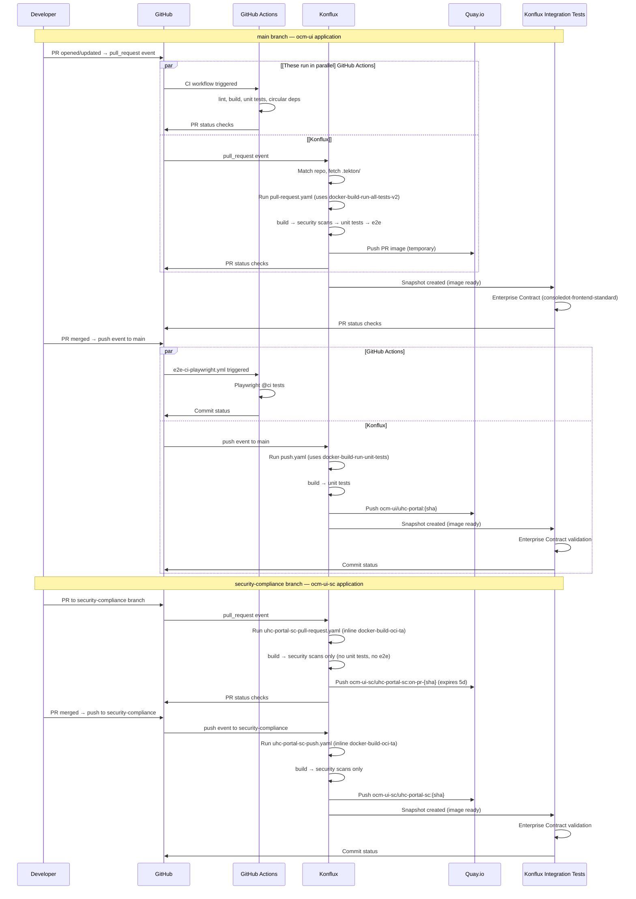
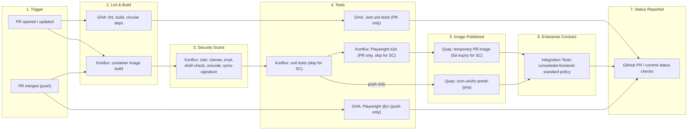
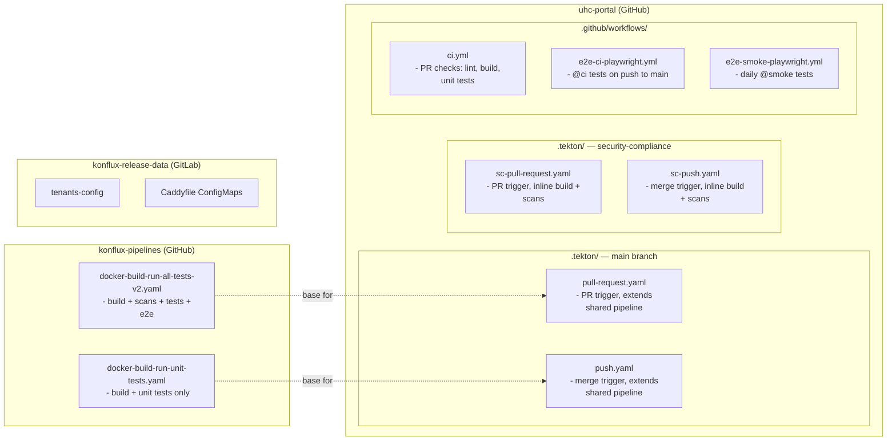
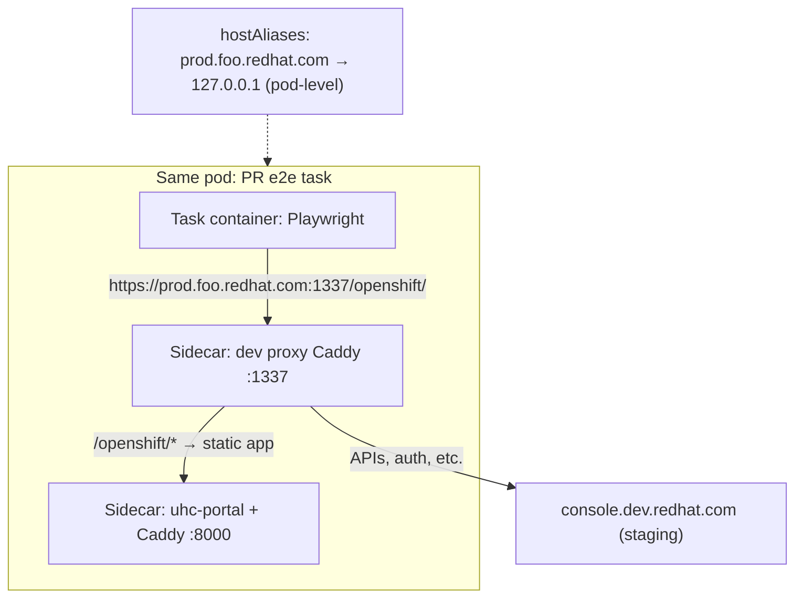

# CI Overview — uhc-portal

## Big picture

Our CI/CD pipeline spans **multiple systems** working together. When you open a PR, several things happen in parallel:

| System | What it does |
|--------|--------------|
| **GitHub Actions** | Fast feedback: lint, build, unit tests |
| **Konflux** | Container build, security scans, Playwright E2E |
| **Konflux Integration Tests** | Policy validation (Enterprise Contract) after build |

After merge, Konflux publishes the production image. Jenkins handles legacy QA workflows (being migrated).

### CI landscape (sequence)

### CI landscape (sequence2)

> **Alternative view — phases left-to-right.** The chart below shows the same pipeline organized by *what happens when* rather than *which system does it*. Nodes indicate the responsible system; labels note when a step is skipped for the `security-compliance` branch.

### Where all the CI pieces live

> **Dotted lines** = `.tekton/` files extend shared pipelines. The SC pipelines do **not** extend shared pipelines — they use an **inline** `docker-build-oci-ta` pipeline (build + scans only, no tests). Node links are clickable on GitHub, not in Cursor's preview.

| Where | What lives there | Plain-English role |
|---|---|---|
| **GitHub** — `uhc-portal/.github/workflows/` | `ci.yml`, `e2e-ci-playwright.yml`, `e2e-smoke-playwright.yml` | **GitHub Actions** workflows — `ci.yml`: fast PR checks (lint, build, unit tests). `e2e-ci-playwright.yml`: Playwright `@ci` tests on push to main. `e2e-smoke-playwright.yml`: scheduled daily `@smoke` tests. |
| **GitHub** — `uhc-portal/.tekton/` (main) | `uhc-portal-pull-request.yaml`, `uhc-portal-push.yaml` | The **ocm-ui** entry points Konflux watches for the `main` branch. They extend the shared `konflux-pipelines` repo (full build + tests + e2e). |
| **GitHub** — `uhc-portal/.tekton/` (SC) | `uhc-portal-sc-pull-request.yaml`, `uhc-portal-sc-push.yaml` | The **ocm-ui-sc** entry points for the `security-compliance` branch. These use an **inline** `docker-build-oci-ta` pipeline — build + security scans only, no unit tests or e2e. Added by Lyn M in PR #478 (OCMUI-3677). |
| **GitHub (upstream)** — `RedHatInsights/konflux-pipelines` | [`pipelines/platform-ui/docker-build-run-all-tests-v2.yaml`](https://github.com/RedHatInsights/konflux-pipelines/blob/main/pipelines/platform-ui/docker-build-run-all-tests-v2.yaml) | The **shared Konflux pipeline**, maintained by Platform Experience (Brandon Tweed). Defines the real steps: build image → security scans → unit tests → run app → run Playwright e2e. Every HCC frontend team points at this file. Only used by `main` branch pipelines. |
| **GitLab** — `konflux-release-data` (internal) | YAML under `tenants-config/.../ocm-ui-tenant/` | Cluster-side config: tenant admin permissions, release plans, integration test scenarios, Caddyfile ConfigMaps, Kustomize wiring. |
| **Konflux UI** (one-time, manual) | `ocm-ui-tenant` namespace | The E2E login credentials secret (`ocm-ui-credentials-secret`). Stored in the cluster via the UI, not in git. |
| **GitHub** — `uhc-portal/build-tools/src/Jenkinsfile` | [`Jenkinsfile`](https://github.com/RedHatInsights/uhc-portal/blob/main/build-tools/src/Jenkinsfile) | **Jenkins** *(legacy)* — Deploys static assets to Akamai CDN via rsync, then busts the CDN cache. Runs per environment branch (prod-stable, prod-beta, qa-stable, etc.). |
| **GitHub** — `uhc-portal/cypress-qe-triggers.sh` | [`cypress-qe-triggers.sh`](https://github.com/RedHatInsights/uhc-portal/blob/main/cypress-qe-triggers.sh), `run/cypress-qe-executor.sh` | **Jenkins** *(legacy, migrating)* — Entry point for QE Cypress smoke tests. Jenkins calls this script with environment, browser, and tag params to run daily smoke tests in a podman pod. |

### Konflux Applications and Release Plans

Two Konflux Applications exist in the `ocm-ui-tenant` namespace:

| Application | Component | Branch | Pipeline type | Quay image path | Release plan |
|-------------|-----------|--------|---------------|----------------|-------------|
| **ocm-ui** | `uhc-portal` | `main` | Shared (konflux-pipelines) — build + scans + tests + e2e | `quay.io/.../ocm-ui/uhc-portal:{sha}` | `ocm-ui-release-as-ms` → `rhtap-releng-tenant` |
| **ocm-ui-sc** | `uhc-portal-sc` | `security-compliance` | Inline (docker-build-oci-ta) — build + scans only | `quay.io/.../ocm-ui-sc/uhc-portal-sc:{sha}` | `ocm-ui-sc-release-as-ms` → `rhtap-releng-tenant` |

Both have **auto-release enabled** with **standing attribution** and release to `rhtap-releng-tenant` (Red Hat release engineering).

An `IntegrationTestScenario` named `ocm-ui-enterprise-contract` validates images against the `consoledot-frontend-standard` policy using the Enterprise Contract pipeline from `konflux-ci/build-definitions`.

> **Persistence risk:** The `ocm-ui` application, component, release plan, and integration test are persisted in `konflux-release-data` (GitLab). The `ocm-ui-sc` resources (application, component, release plan) currently exist **only in the Konflux UI** — they were created there but have not been committed to `konflux-release-data`. If the `ocm-ui-tenant` namespace is ever recreated from the Git source of truth, the SC configuration would be lost. Consider adding `ocm-ui-sc_*` YAML files to the tenant's `kustomization.yaml`.

---

## Konflux triggers (Pipelines-as-Code)

> **CEL expression** = Common Expression Language — a lightweight `if` statement that Pipelines-as-Code (PaC) evaluates against the incoming GitHub webhook to decide whether to launch a PipelineRun.

| When | Which `.tekton/` file | CEL expression | Pipeline used | What actually runs |
|---|---|---|---|---|
| PR opened, updated, or `/retest` against `main` | `uhc-portal-pull-request.yaml` | `event == "pull_request" && target_branch == "main"` | Shared: `docker-build-run-all-tests-v2.yaml` | Build → security scans → unit tests → **Playwright e2e** |
| Commit lands on `main` (merge) | `uhc-portal-push.yaml` | `event == "push" && target_branch == "main"` | Shared: `docker-build-run-unit-tests.yaml` | Build → unit tests. Publishes `ocm-ui/uhc-portal:{sha}`. |
| PR against `security-compliance` | `uhc-portal-sc-pull-request.yaml` | `event == "pull_request" && target_branch == "security-compliance"` | Inline: `docker-build-oci-ta` | Build → security scans only. PR image expires in 5 days. |
| Commit lands on `security-compliance` (merge) | `uhc-portal-sc-push.yaml` | `event == "push" && target_branch == "security-compliance"` | Inline: `docker-build-oci-ta` | Build → security scans only. Publishes `ocm-ui-sc/uhc-portal-sc:{sha}`. |

---

## How E2E tests run (main branch only)

> This section only applies to the **main branch** (`ocm-ui` application). The `security-compliance` branch does not run E2E tests.

Playwright E2E tests need a running application to test against. In Konflux, we achieve this using **sidecars** — additional containers that run alongside the main test container within the same pod.

Our E2E setup uses two sidecars:
1. **App sidecar** — Runs the built uhc-portal UI using [Caddy](https://caddyserver.com/), a lightweight web server. Caddy serves the static assets on port 8000 using a ConfigMap-based Caddyfile (`ocm-ui-app-caddy-config`).
2. **Proxy sidecar** — Routes requests so that `/openshift/*` paths go to the app sidecar (our code), while everything else (APIs, auth) proxies to `console.dev.redhat.com` (the staging backend). This is configured via `ocm-ui-dev-proxy-caddyfile`.

Both ConfigMaps are defined in [**konflux-release-data**](https://gitlab.cee.redhat.com/releng/konflux-release-data/-/tree/main/tenants-config/cluster/stone-prd-rh01/tenants/ocm-ui-tenant) under the `ocm-ui-tenant` configuration. The `hostAliases` setting maps `prod.foo.redhat.com` → `127.0.0.1`, so traffic stays local to the pod and hits our proxy sidecar. The `prod.foo` hostname is whitelisted in `sso.redhat.com`, allowing SSO login to work during tests.

---

## What our `.tekton/` files actually control

Our `.tekton/` files are **small customization layers**. They don't define the build/test steps — they configure *when* to run, *what image* to build, and *what scripts* to execute.

### main branch (extends shared pipeline)

| What | Our files control | Shared pipeline controls |
|---|---|---|
| **Pipeline type** | `PipelineRun` — a single invocation with inputs | `Pipeline` — the reusable task graph |
| **Trigger** | CEL: `event == "pull_request"` or `event == "push"`, `target_branch == "main"` | — |
| **Task graph** (build → scans → tests → e2e) | — | Entirely defined upstream. We don't add, remove, or reorder tasks. |
| **Per-project inputs** | `git-url`, `revision`, `output-image`, `dockerfile`, e2e params (app port, HCC env, credentials secret) | Declares param signatures only |
| **Script bodies** | `unit-tests-script`, `run-app-script`, `e2e-tests-script` | Just `exec`s whatever we pass |
| **Compute overrides** | `run-unit-tests` → 6 Gi, `run-e2e-tests` → 10 Gi (PR only) | Defaults only |
| **E2E pod wiring** | `hostAliases`, Caddyfile ConfigMap volume, sidecar specs (PR only) | — |
| **Workspaces** | PVC + `git-auth` secret. 10 Gi (PR), 1 Gi (push) | Declares which workspaces tasks need |
| **Behaviors** | `max-keep-runs: 3`. `cancel-in-progress: true` (PR), `false` (push) | — |
| **Service account** | `build-pipeline-uhc-portal` — pushes to Quay, accesses secrets | — |

When the upstream shared pipeline changes, every consumer's CI behavior changes with no commit on our side.

### security-compliance branch (inline pipeline)

The SC files (`uhc-portal-sc-*`) are self-contained — the full pipeline spec is **inlined** in each YAML file (~540 lines each). They use `docker-build-oci-ta` from the Konflux Tekton catalog bundles.

| What | Value |
|---|---|
| **Trigger** | CEL: `target_branch == "security-compliance"` |
| **Tasks** | init → clone → prefetch → build-container → build-image-index → security scans (clair, clamav, snyk, shell-check, unicode-check, ecosystem-cert-preflight, rpms-signature-scan) → apply-tags → push-dockerfile |
| **No tests** | No `run-unit-tests` or `run-e2e-tests` tasks |
| **Compute override** | `build-container` → 10 Gi |
| **Service account** | `build-pipeline-uhc-portal-sc` |
| **PR image expiry** | 5 days |
